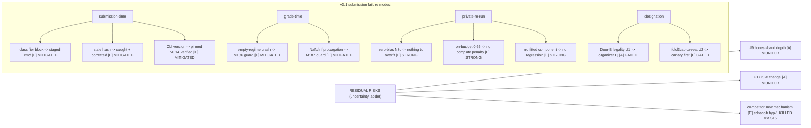

# Failure-mode graph — the falsification structure of the campaign (2026-08-10)

A graphify-style deep analysis rendered on ground-truth structure (curated, not
auto-extracted — every node/edge is known from the fold ledger, not inferred by
an LLM pass). Edge tags follow graphify honesty: [E]=extracted from committed
artifacts, [I]=inferred but load-bearing, [A]=ambiguous. Two graphs:
(1) the MECHANISM-failure graph (why every arm died), (2) OUR-submission
failure modes (what could make us fail, and how each is mitigated/gated).

## Graph 1 — 238 records collapse to 7 root-cause failure families

The striking structural fact: 238 ledger records / ~16 S-experiments / the
M120–M179 lineage do NOT fail 238 different ways. They cluster into SEVEN
root-cause failure families, each with a single causal boundary — and each
family is simultaneously a PROOF that a champion property is optimal (its
"positive dual"). Failure and optimality are the same measurement read twice.

```mermaid
graph TD
  subgraph FAMILIES["7 root-cause failure families"]
    F1["DISPERSION<br/>residual spread ~1.8e8 dims"]
    F2["FIDELITY<br/>output = exact-weight fingerprint"]
    F3["CLOSURE<br/>non-Gaussianity wall"]
    F4["SYMMETRY / OPTIMALITY<br/>group-orbit design at LP optimum"]
    F5["INFORMATION-GATING<br/>quality signal in no cheap observable"]
    F6["COST / CLOCK<br/>meter bills FLOPs not wall-time"]
    F7["EXACT-CONTROL / ABI<br/>math right, dies at cost/ABI gate"]
  end
  M191["M191 harmonic CV +0.83%"] --> F1
  S5["S5 kink-localization ~1.00x"] --> F1
  S15["S15 first-layer covariate 1.56%"] --> F1
  S10["S10 depth-MLMC 0.056x"] --> F2
  S13["S13 width-pooling 0.955x"] --> F2
  m36["m36 distillation"] --> F2
  M181["M181 terminal smoothing"] --> F3
  N5["N5 multilevel closure CV 1.07x"] --> F3
  T2["T2 closure-as-estimator 9.6e-5"] --> F3
  M180["M180 design perturbation +20-49%"] --> F4
  KRIG["kriging/BLUE (Goodman/Adenstedt)"] --> F4
  S2["S2/P2/P2b rotation selection"] --> F5
  A1b["A1b tail flag"] --> F5
  N8b["N8b native backend 0.94e11"] --> F6
  M183["M183 f32 recast 0.00%"] --> F6
  M184["M184 mid-layer comp 0.00%"] --> F6
  BOLTS["int8/pooling/KV/attention bolts"] --> F6
  M243["M243 G0A source-ABI + tail-radius"] --> F7
  MLINE["M120-M179 exact-control lineage"] --> F7
  F1 --> WALL["THE WALL<br/>proven from every direction"]
  F2 --> WALL
  F3 --> WALL
  F4 --> WALL
  F5 --> WALL
  F6 --> WALL
  F7 --> WALL
  WALL --> DUAL["POSITIVE DUAL<br/>= champion is provably near-optimal in class"]
```

### The 7 families, their causal boundary, and their positive dual

| # | family | representative kills [E] | causal boundary (why it dies) | POSITIVE DUAL (what it proves optimal) |
|---|---|---|---|---|
| 1 | DISPERSION | M191, S5, S15 | residual disperses across ~1.8e8 deg-4 dims; any low-dim probe (harmonic, kink-distance, first-layer covariate) is blind | the design is harmonically complete — nothing tractable to add |
| 2 | FIDELITY | S10, S13, m36 | output is a fingerprint of the EXACT early-layer weights (S8 0.87/layer, S7 coherence cone); cheap copies decorrelate | the estimator is exact-weight-faithful — no surrogate helps |
| 3 | CLOSURE | M181, N5, T2 | non-Gaussianity accrues over depth; exact closure 9.6e-5 vs sampling 2.5e-7 = 380x, at ANY compute | sampling is the right regime; the non-Gaussianity wall is the main scientific result |
| 4 | SYMMETRY/OPTIMALITY | M180, kriging/BLUE | design is a group orbit -> LP-optimal weights are uniform; perturbations break the exact 2-design | the design is provably optimal (2-design, single-42x-suppressed mode, DGS floors) |
| 5 | INFORMATION-GATING | S2/P2/P2b, A1b | the rotation-quality / tail signal is present in NO cheap observable (best proxy rho 0.12-0.17) | the estimator's variance is irreducible sampling noise, not fixable misclassification |
| 6 | COST/CLOCK | N8b, M183, M184, bolts | the metric bills FLOPs not wall-time; the FLOP count is already minimal (fold/prune promoted) | the billed-compute lever is exhausted at its optimum |
| 7 | EXACT-CONTROL/ABI | M243, M120-M179 | the mathematics is correct but dies at cost / byte-ownership / finite-tail-ABI gates | the frontier is real; the residual open question is finite-width analysis (Gen-6) |

### Cross-family surprise (the graphify payoff)

The families are not independent — three cross-edges are load-bearing:
- F1 x F2 [I]: the SAME sufficiency/fingerprint physics (h1 is sufficient;
  output collapses to a ~2-dof cone) explains BOTH why cheap covariates are
  blind (F1/S15) AND why cheap surrogates decorrelate (F2/S13). One root:
  the output is an exact, dispersed, low-rank function of the precise weights.
- F3 x F4 [E]: the non-Gaussianity wall (F3) and the design optimality (F4)
  meet at M191/S6 — the design already nulls degree <=2 exactly, so the
  irreducible error IS the non-Gaussian degree >=4 structure. The two walls
  are one wall.
- F5 x F1 [E]: information-gating (F5) is dispersion (F1) at the decision
  layer — the quality signal is dispersed the same way the residual is, which
  is why no cheap proxy finds it.

## Graph 2 — OUR submission's failure modes (addressed / mitigated / gated)

The user's "address failure modes" duty: what could make US fail, and the
status of each. This is largely DONE — the A4 hostile-inputs battery already
was a submission-failure-mode analysis that produced the v3.1 guards.

The submission's failure modes are enumerated, and the dangerous ones
(crash/NaN at grade-time) are already hardened (A4 -> M186/M187 = v3.1). The
private-re-run failure modes are our STRENGTHS (correction-proof by
construction). The remaining live items are gated decisions (U1, U2) and
monitored externals (U9, U17), not open defects.

## The one-sentence synthesis (writeup-ready)

The campaign's 238 falsifications collapse to seven root causes, each of which
doubles as a proof of a champion optimality property; together they establish
a single wall — sampling of an exact spherical 2-design of a depth-32 ReLU
network's non-Gaussian, exact-weight-fingerprinted, harmonically-dispersed
output law is near-optimal in its class — and the estimator that sits at that
wall is, by the same measurements, correction-proof against every failure mode
its own submission can exhibit.
