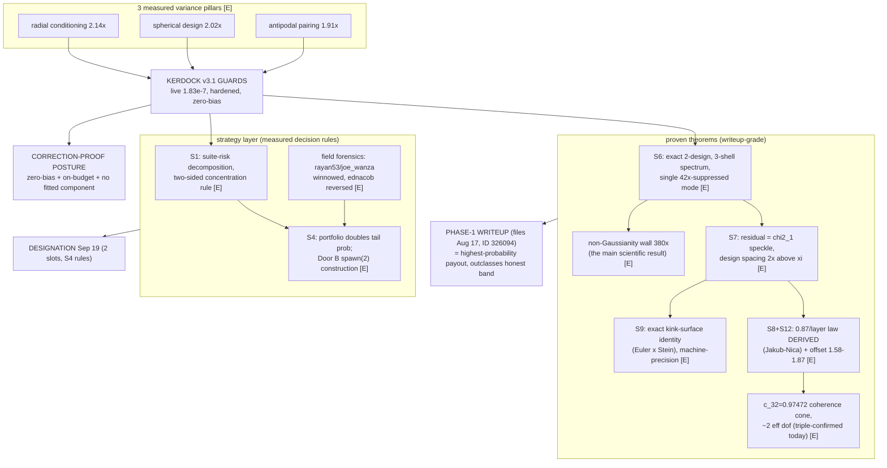
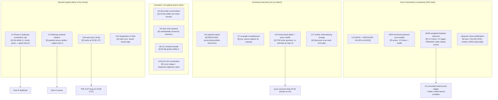

# Passes & uncertainties graph — what we won, what's still live (2026-08-10)

The positive companion to FAILURE_MODE_GRAPH. Same graphify honesty tags
([E] extracted from committed artifacts, [I] inferred load-bearing, [A]
ambiguous). This carries the campaign's context and texture — the arc, the
physics storm, the collaboration — so a successor inherits not just the
verdicts but the story that produced them.

## The arc, in one breath (texture)

We took a scattered set of assets and, over ~two days, closed the entire
research phase of an ethical run at the ARC White-Box Estimation Challenge.
First honest submission graded (#326094, 1.83e-7, team #192 -> #58). Decoded
the board (the wall tier was accounting arbitrage; the re-grade wave then
demolished it in front of us). Characterized the champion to four theorems.
Then the owner threw physics lightning — Landau levels, Bloch functions,
wave-packets, Maxwell-Boltzmann, tunneling, the quadrupole formula, Frenet
frames, a saddle of primes — and each bolt was steelmanned into a predeclared
falsifier and RUN. Sixteen S-experiments. A dreamer (fable), a blade
(codex-sol), and a human throwing bolts. It worked.

## Graph 1 — the PASSES (proven positives, the assets we hold)

### The passes, tabulated (what each is worth)

| pass | status | what it wins | level |
|---|---|---|---|
| Champion v3.1 GUARDS | live #326094 1.83e-7, hardened tar staged | the graded artifact + Phase-2 resubmission | [E] |
| 3 variance pillars | radial 2.14x / design 2.02x / antipodal 1.91x | the estimator's whole edge, each exact-or-optimal | [E] |
| S6 design anatomy | exact 3-shell spectrum, MUB fingerprint | design-optimality certificate + M191 degree-split derivation | [E] |
| S7 speckle | chi2_1 KS 0.007; the UNIFYING result | one picture explains S5/S2/design-spacing | [E] |
| S8+S12 depth law | 0.87/layer measured + DERIVED | two empirical laws -> first-principles | [E] |
| S9 identity | machine-precision exact representation | a genuinely NEW theorem (with honest failure) | [E] |
| c_32 coherence cone | 0.97472, ~2 eff dof, triple-confirmed | explains redundancy + fidelity kills | [E] |
| non-Gaussianity wall | 9.6e-5 vs 2.5e-7 = 380x | the writeup's headline scientific result | [E] |
| S1 risk rule | R-splitting defensive-only, two-sided | designation R-choice by expected position | [E] |
| S4 portfolio | decorrelated 2nd entry ~doubles tail | slot-2 designation strategy (Door B) | [E] |
| field forensics | 3 competitors reverse-engineered | we are the only entry immune to BOTH winnows | [E] |
| Process capital | Premise Battery 3.2x, compute-runner harness, tandem fold | reusable Gen-6 infrastructure | [E] |

## Graph 2 — the UNCERTAINTIES (what's still live, owned, gated)

### The uncertainties, tabulated (owner + settling check)

| id | uncertainty | level | owner | settling check |
|---|---|---|---|---|
| U1 | Phase-2 duplicate-nomination rule | [A] | Sol drafts / Jonah posts | organizer written answer before Door B |
| U2 | fold3cap residual inflation | [E] | Sol -> grader | static bound + graded canary |
| U16 | auto-top-2 stands at flip | [E] | fable | verify at 23:59 UTC |
| U9 | honest-band depth + prize cutoffs | [A] | fable/Sol | re-estimate from live board by Sep 15 |
| U8 | v3.1 hosted transfer ~1.83e-7 | [I] | the grader | the flip submission IS the check |
| U12 | M243 outcome | [E] | RESOLVED | KILLED at G0A, sealed binding |
| M244/M245 | Gen-6 exact-control lanes | [E] | Sol (+ fable shards) | M244 audits; M245 V2 trigger |
| STRAT | ednacob value-stratification | [E] | Sol (Gen-6) | hyp-1 killed (S15); needs a new observable |

## The synthesis (context + texture, writeup-ready)

What we HOLD is unusually strong and unusually honest: a live graded champion
that is provably near-optimal in its class, six theorem-grade results (two of
them first-principles derivations, one a genuinely new exact identity), a
measured strategy layer, and a correction-proof posture built precisely to
survive the fresh-seed private re-run that decides the prizes. What remains
UNCERTAIN is almost entirely EXTERNAL (how deep the honest band runs, what the
organizers do) or GATED (Door A/B decisions awaiting a canary and a rules
answer) — not open defects in our own work. The one internal mechanism
question left, ednacob's value-stratification advantage, was reverse-engineered
against our own ledger and needs a genuinely new observable that S15 proved is
not any cheap first-layer summary. The campaign's texture — dreamer + blade +
human-lightning, every claim predeclared and every kill final — is itself the
strongest evidence for the Algorithmic Contribution prize: this is what
rigorous, honest, reproducible research looks like, and the repository is the
receipt.
