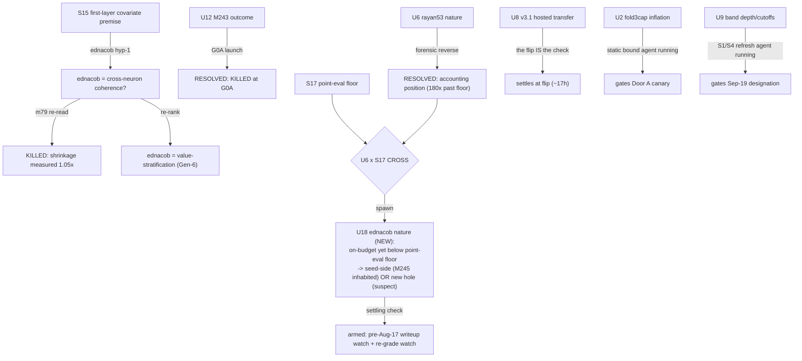

# Uncertainty recursion — the fold methodology applied to the ladder (2026-08-10)

The recursive-estimator-folding discipline, generalized from mechanisms to
UNCERTAINTIES (owner-directed). An uncertainty is a candidate:
`{hypothesis, cheapest settling check (its falsifier), resolve/kill gate,
owner, evidence level}`. Resolving one SPAWNS children (the next questions);
resolving two together CROSSES into a sharper third. Same honesty tags as the
ledger: resolved uncertainties are dispositions, not deletions — nothing
silently vanishes.

## The mutation graph (what resolved what, and what it spawned)

## The live uncertainty population (candidates, gated)

| id | hypothesis | settling check (cheapest falsifier) | gate/resolve | owner | status |
|---|---|---|---|---|---|
| U1 | Phase-2 duplicate-nomination allowed? | organizer Q (Sol drafts, Jonah posts) | written answer before Door B | Sol/Jonah | OPEN external |
| U2 | fold3cap residual inflation magnitude | static code bound | RESOLVED 2026-08-10: NEEDS-FIX. Billed-F clean (0); residual (lambda*R) channel inflates with process history (0.035% of B single-net .. ~11% at K=100; near-CAP nets at K>=92 breach C>B -> zero-prediction). T3 gates blind to it. One-line behavior-preserving fix: get_active_budget().flops_used (NOT current_budget() - absent in flopscope v0.14). Canary BLOCKED until Sol applies fix. See u2_fold3cap_bound/ | fable->Sol | RESOLVED (fix owed) |
| U4 | private suite 50 vs 100 nets | rules re-read / rider on U1 | scales all P-tables | fable | OPEN cheap |
| U7 | re-grade wave complete? | board watch | joe_wanza settled at 2.11e-8 | fable | MONITOR |
| U8 | v3.1 hosted transfer ~1.83e-7 | the flip submission grade | +/-2% of local | grader | settles at flip |
| U9 | honest-band depth + prize cutoffs | S1/S4 refresh | RESOLVED 2026-08-10: honest band flat-zero unreachable (S17 floor); Door A P(win) 0.877/0.940 at 1.55/1.6e-7 (canary-gated), Door B 0.057/0.124 (U1-gated); see u9_designation_refresh/ | fable | RESOLVED |
| U10 | designation UI flow | walk it once | needs Jonah login | Jonah | OPEN external |
| U14/U15 | S12 curve-shape / dispersion | full 1/n field theory | writeup future-work | fable | DEFERRED |
| U17 | further rule/metering change | discourse scan | new v0.x post | fable | MONITOR |
| **U18** | **ednacob: seed-side or suspect?** | **pre-Aug-17 writeup + re-grade watch** | **publishes seed-side=(a); silence+regrade=(b)** | **fable/Sol** | **NEW, spawned** |
| M244/M245 | Gen-6 exact-control | RED chain -> V2 -> shards | Sol's gates | Sol(+fable shards) | OPEN Gen-6 |

## Resolved (dispositions retained)

- U6 rayan53: accounting position, winnowed by fresh-seed execution [E].
- U12 M243: KILLED at G0A, sealed binding [E].
- U5 (rival variance / ednacob mechanism): cross-neuron shrinkage KILLED
  (m79 1.05x); re-ranked to value-stratification (Gen-6); the CHEAP
  first-layer version KILLED (S15 1.56%); the point-eval-impossibility
  SHARPENED it into U18 (S17).

## The recursion's next move (per the discipline: one settling check at a time)

The two cheapest OPEN uncertainties are already dispatched (U2 static bound,
U9 refresh — agents running). U18 is the newly-spawned high-value one, and
its settling check is a MONITOR already armed (the pre-Aug-17 discourse
watch), so no new compute is needed — it resolves by Aug 17 or the next
re-grade. U4 (suite size) folds into the U1 organizer question. Everything
else is external (Jonah/organizer) or deferred (theory future-work).

## The pattern (mirrors the mechanism recursion)

Just as the 238 mechanism kills converged to one god-node, the uncertainty
recursion is converging too: the live uncertainties reduce to THREE roots —
(1) EXTERNAL organizer facts (U1/U4/U10/U17 — we cannot resolve, only ask/
watch), (2) the FLIP + designation execution (U2/U8/U9 — resolving now/
tonight), and (3) the ONE deep question, U18: is the seed-side region
inhabited? ednacob is the empirical probe, M245 is our own probe, and they
are the same question — the uncertainty analog of the god-node.
